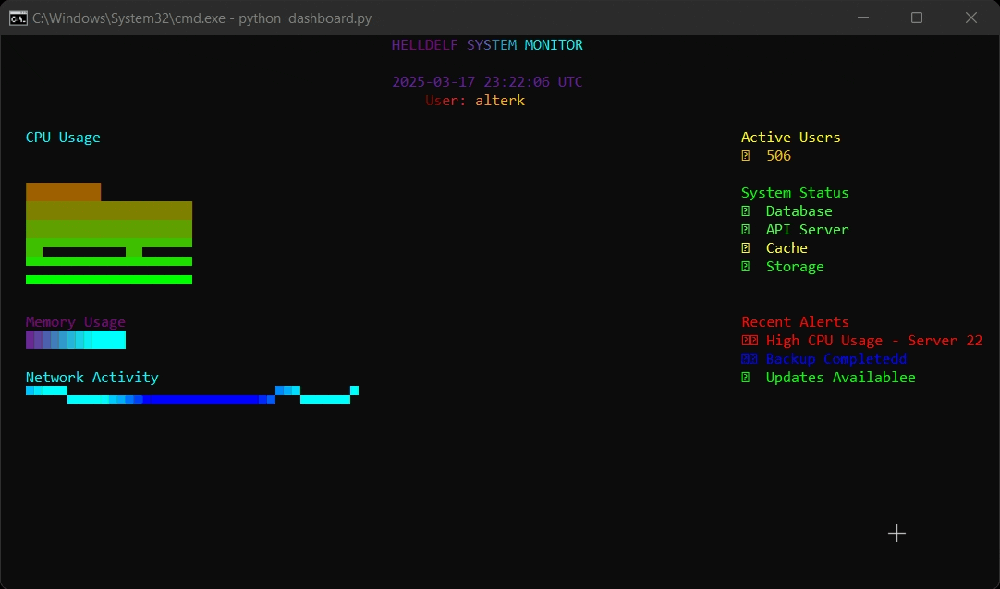
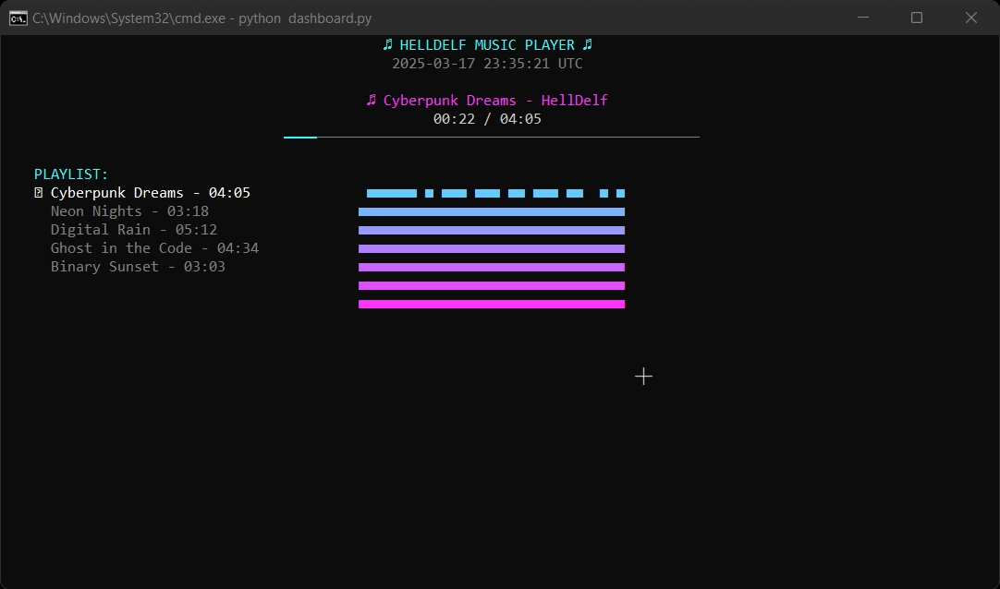

<div align="center">

```py
""" ╔═══════════════════════════╗
    ║   HELLDELF - V2.2.3       ║
    ╚═══════════════════════════╝
    README.md             """
```

---


<div>   </div>

---


</div>

### Terminal options
- **Matrix Processing** -  color algorithms
- **Animation Engine** -  effects
- **Strike System** -  terminal control
- **ASCII** -  pattern generation
- **Stealth Mode** - invisible cursor

## DEPLOYMENT REQUIREMENTS

```bash
Python >= 3.8
RAM >= 256MB
GPU Support: Optional but recommended
Terminal: 256 colors minimum
OS Support: Linux | Windows | macOS
```

## Install

### Quick deploy
```bash
pip install helldelf --w
```

### Git deploy
```bash
git clone https://github.com/alterkleo/helldelf.git
cd helldelf
python setup.py install --w
```

---

<div align="center">

**[alterkleo](https://github.com/alterkleo)**

</div>
